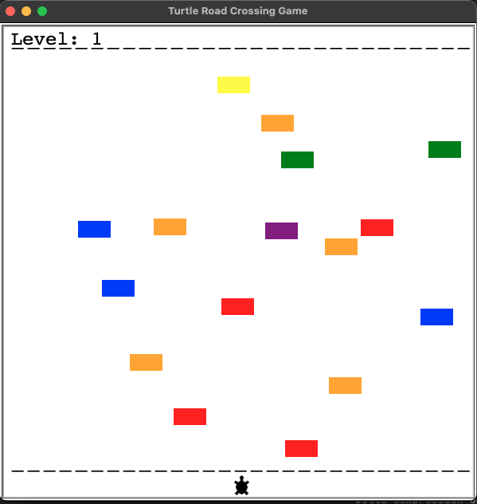

# Turtle Crossing Game

This is a classic arcade-style game implemented using Python's Turtle graphics library. In this game, the player controls a turtle that needs to cross a busy road while avoiding oncoming traffic.

## Gameplay

- Use the **Up Arrow** key to move the turtle upwards and cross the road.
- Avoid colliding with the moving cars on the road.
- Reach the other side of the road safely to score points and advance to higher levels.
- Be careful! The game gets more challenging as you progress, with faster cars and more obstacles.

## How to Play

1. Run the `main.py` file using a Python interpreter.
2. Use the **Up Arrow** key to move the turtle upwards.
3. Navigate the turtle across the road while avoiding collisions with cars.
4. Score points for each successful crossing and advance to higher levels.
5. If the turtle collides with a car or fails to reach the other side, the game ends.
6. Close the game window to exit.

## Features

- Smooth and intuitive controls using arrow keys.
- Dynamic gameplay with increasing difficulty levels.
- Scoreboard to keep track of your score and current level.
- Enjoyable and addictive gameplay experience.

## Requirements

- Python 3.x
- Turtle graphics library (usually comes pre-installed with Python)

## Installation

1. Clone or download the repository to your local machine.
2. Make sure you have Python installed.
3. Run the `main.py` file to start the game.

## Future Feature

1. Allow player to move left and right